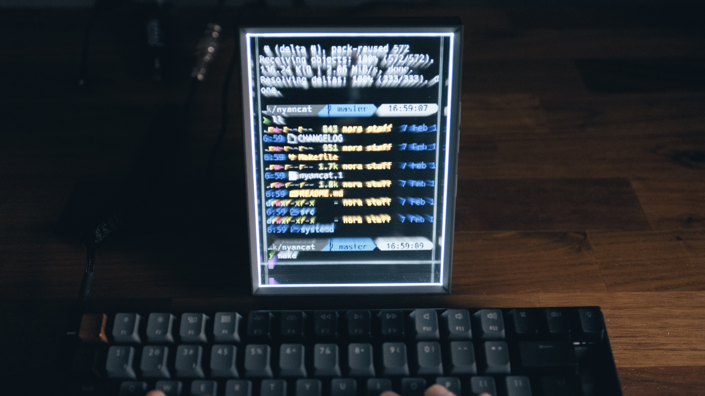

hyper-holoplay
==========================

A Holoplay integration for Hyper and [Looking Glass](https://lookingglassfactory.com/) using [Holoplay.js](https://docs.lookingglassfactory.com/developer-tools/three) and [Three.js](https://threejs.org/).

## Prerequisites

- [Holoplay Service](https://docs.lookingglassfactory.com/getting-started/holoplay-service)
- [Hyper](https://hyper.is)

## How to use

1. Clone this repository
2. run `npm install`
3. Symlink the root directory to `~/.hyper_plugins/local/`
4. Add `'hyper-holoplay` to `localPlugins` in `~/.hyper.js`.

## License

MIT by Takuya Matsuyama
